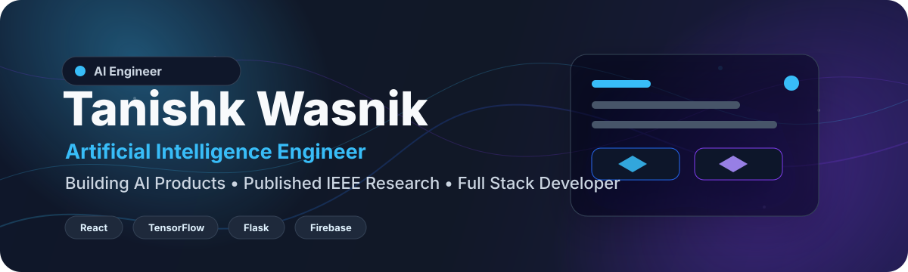
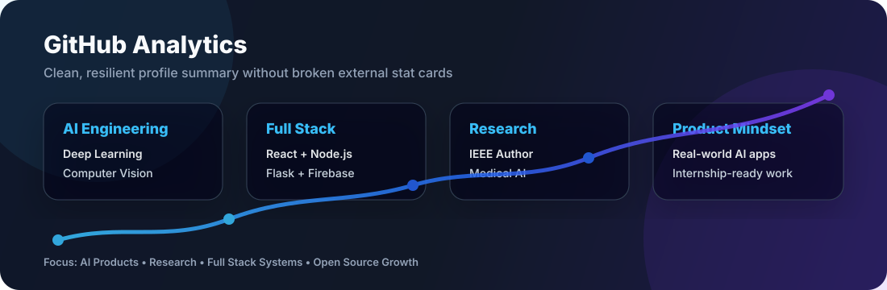

 

 

---

## Hi, I'm Tanishk Wasnik

I'm an Artificial Intelligence Engineering student focused on building real-world AI applications that combine machine learning, clean product thinking, and full stack engineering.

My work sits at the intersection of:

- Deep Learning and Computer Vision
- Large Language Models and RAG systems
- Full Stack Product Development
- Medical AI and applied research
- Scalable AI-powered web platforms

Currently, I'm building production-ready AI systems with React, Flask, Firebase, TensorFlow, and modern backend workflows.

---

## Current Focus

<table>
  <tr>
    <td width="50%">
      <h3>Building</h3>
      
<strong>AI career and productivity platforms</strong> with resume analysis, interview intelligence, skill-gap detection, and job matching.

    </td>
    <td width="50%">
      <h3>Researching</h3>
      
<strong>Deep learning for dermatological image classification</strong>, with a focus on accurate medical computer vision systems.

    </td>
  </tr>
  <tr>
    <td width="50%">
      <h3>Learning</h3>
      
Advanced LLM workflows, MLOps, model evaluation, system design, and production deployment patterns.

    </td>
    <td width="50%">
      <h3>Open To</h3>
      
AI/ML internships, full stack roles, research collaborations, and open-source AI projects.

    </td>
  </tr>
</table>

---

## Tech Stack

### Languages

### Frontend

### Backend and Database

### AI, ML and Data

### Tools

---

## Featured Projects

<table>
  <tr>
    <td width="50%">
      <h3>SkinWise</h3>
      
<strong>AI-powered skin disease detection platform</strong>

      
Deep learning system for dermatological image classification using CNN-based modeling, TensorFlow, Grad-CAM explainability, and a patient-friendly full stack interface.

      

        
        
        
        
      

      

        
      

    </td>
    <td width="50%">
      <h3>CareerAI</h3>
      
<strong>AI career assistant and internship preparation platform</strong>

      
Full stack AI product with resume analysis, ATS scoring, mock interviews, roadmap generation, job recommendation, GitHub profile analytics, and skill-gap analysis.

      

        
        
        
        
      

      

        
      

    </td>
  </tr>
  <tr>
    <td width="50%">
      <h3>LegalEase</h3>
      
<strong>LLM-powered contract analysis system</strong>

      
Legal document assistant for contract comparison, risk prediction, clause extraction, document scoring, and explainable contract insights.

      

        
        
        
      

      

        
      

    </td>
    <td width="50%">
      <h3>IEEE Research</h3>
      
<strong>Hybrid CNN-Based Model for Accurate Dermatological Image Classification</strong>

      
Research work focused on medical image classification, deep learning pipelines, visual disease recognition, and model performance evaluation.

      

        
        
        
      

      

        
      

    </td>
  </tr>
</table>

---

## GitHub Analytics

 
 

---

## Contribution Snake

---

## Research

**Publication:** Hybrid CNN-Based Model for Accurate Dermatological Image Classification  
**Venue:** IEEE CCGE 2026  
**Areas:** Deep Learning, Computer Vision, Medical AI, Dermatological Image Classification

This research strengthens my practical AI work by connecting model development with evaluation, reproducibility, and real-world healthcare use cases.

---

## What I Care About

- Building AI systems that are useful beyond demos
- Writing clear documentation and maintainable code
- Turning research ideas into working products
- Learning from strong engineers and contributing to serious teams
- Making complex AI workflows easier for people to use

---

## Let's Connect

 
 

<strong>AI Engineer | Full Stack Developer | IEEE Research Author</strong>

